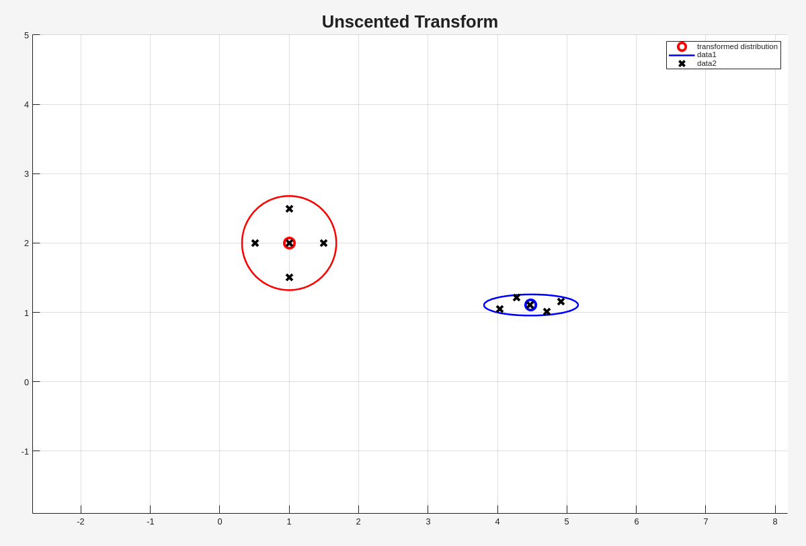
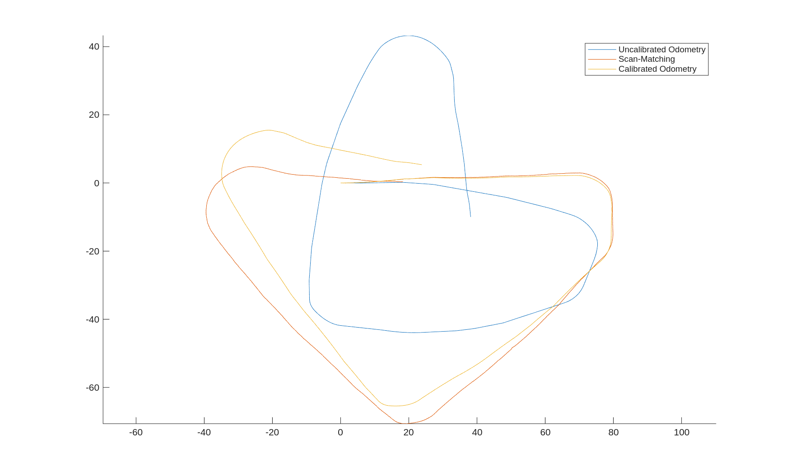

# Robot_mapping
This repository is a used to record learning prgress of robotics course

Source file [Robot Mapping](http://ais.informatik.uni-freiburg.de/teaching/ws13/mapping/)

The tools provided by source file is slightly modified to be compatible with Matlab R2025b

---

# Results

| Title | Video |
| --- | --- |
| odometry | <video controls width="600" src="https://github.com/user-attachments/assets/8581eed7-1dd1-4ebc-a152-982477e45372"></video> |
| EKF SLAM | <video controls width="600" src="https://github.com/user-attachments/assets/73430fb7-edc1-4bac-a772-9e65e656bbd6"></video> |
| Unscented transform | |
| UKF SLAM | <video controls width="600" src="https://github.com/user-attachments/assets/dad4f5e3-122a-43b2-a6c0-4d93ec2fdb30"></video> |
| Grid mapping | <video controls width="600" src="https://github.com/user-attachments/assets/05ef36a3-f72c-47e7-b0dc-630c6a53d1fc"></video> |
| Particle filter | <video controls width="600" src="https://github.com/user-attachments/assets/ad352402-d547-442e-8083-5c641734ddfe"></video> |
| Fast SLAM | <video controls width="600" src="https://github.com/user-attachments/assets/0e7f5520-ca31-48f6-90dc-c74f64f7dec1"></video> |
| odometry calibration |  |
| Graph-based SLAM | <video controls width="600" src="https://github.com/user-attachments/assets/6cb5cae6-8498-4fb1-803d-821414af011e"></video> |

